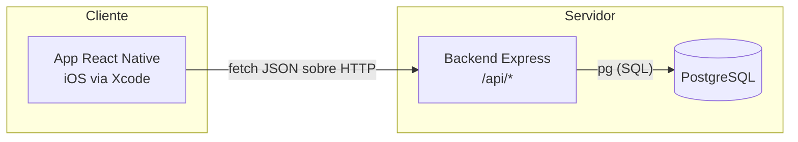

# Seis Más

App que conecta grupos de 6 personas con intereses comunes a planes sorpresa
organizados por comercios locales. Este repositorio contiene el **MVP
técnico** (Fase 2 del roadmap): registro y test de personalidad, modelo de
datos que soporta el matching, y la base de la app móvil. El algoritmo de
matching avanzado (IA) queda fuera de alcance a propósito — ver
`backend/src/routes/matching.js`.

## Estructura del repositorio

```
6_mas/
  db/
    DISEÑO.md     # justificación técnica del modelo de datos + diagrama ER (Mermaid)
    schema.sql     # script SQL completo (PostgreSQL)
  backend/         # API REST Node.js + Express + PostgreSQL
  mobile/          # capa JS de la app React Native (CLI, sin Expo)
  roadmap.png      # referencia de producto (no técnico)
```

## Arquitectura general



- La app móvil habla con el backend por HTTP/JSON (`mobile/src/services/api.js`).
- El backend expone rutas REST por entidad y usa `pg` directo contra
  PostgreSQL (sin ORM, ver justificación en `backend/src/config/db.js`).
- El esquema de base de datos (`db/schema.sql`) es la fuente de verdad de las
  reglas de integridad (tamaño de grupo, rating 1-5, unicidad de email, etc.),
  no solo la capa de aplicación.

## 1. Levantar la base de datos

Requiere PostgreSQL 13+ corriendo localmente (o accesible por red).

```bash
createdb seis_mas
psql -d seis_mas -f db/schema.sql
```

Esto crea las extensiones, tablas, índices, constraints y triggers descritos
en `db/DISEÑO.md`.

## 2. Levantar el backend

```bash
cd backend
cp .env.example .env   # ajusta DATABASE_URL a tu instancia local
npm install
npm run dev             # nodemon, recarga en caliente
```

Verifica que responde:

```bash
curl http://localhost:3000/health
```

## 3. Compilar y correr la app en Xcode

La guía detallada está en `mobile/README.md`. Resumen:

1. Generar el proyecto nativo: `npx @react-native-community/cli init SeisMas`.
2. `cd ios && pod install`.
3. Abrir `SeisMas.xcworkspace` (no el `.xcodeproj`) en Xcode.
4. Configurar bundle identifier y signing team en la pestaña "Signing & Capabilities".
5. Copiar `mobile/src` dentro del proyecto generado.
6. Compilar (⌘R) contra el simulador (usa `http://localhost:3000` automáticamente)
   o un dispositivo físico (usa la IP LAN de tu Mac, configurada en
   `mobile/src/config/env.js`; requiere una excepción puntual de App Transport
   Security en desarrollo — documentada en `mobile/README.md`).

## Cómo se conectan las tres piezas

1. **Base de datos → Backend**: el backend abre un pool de conexiones (`pg`)
   usando `DATABASE_URL` del `.env`. Todas las reglas de integridad fuertes
   (unicidad, tamaño de grupo = 6, rating 1-5) viven en el propio Postgres,
   así que cualquier cliente futuro del backend (panel web de comercios,
   jobs de matching) hereda las mismas garantías sin duplicarlas en código.
2. **Backend → App móvil**: la app consume `/api/usuarios`, `/api/intereses`,
   `/api/grupos`, `/api/eventos`, `/api/comercios`, `/api/anfitriones` y
   `/api/feedback` vía `mobile/src/services/api.js`, apuntando a
   `mobile/src/config/env.js` para resolver la URL correcta según si corre en
   simulador o dispositivo físico.
3. **Flujo de usuario del MVP**: `RegistroScreen` (POST `/api/usuarios`) →
   `TestPersonalidadScreen` (POST `/api/usuarios/:id/test-personalidad`) →
   `GruposScreen` (GET `/api/grupos/:id`). La asignación real a un grupo de 6
   y el emparejamiento con eventos de comercios es el trabajo pendiente de
   `/api/matching` (Fase 2 avanzada / IA).

## Decisiones de diseño relevantes (resumen)

- **UUIDs en vez de IDs secuenciales** en todas las PK: evita filtrar volumen
  de negocio por IDs y facilita generación distribuida a futuro.
- **Soft delete (`deleted_at`)** en usuarios, grupos, comercios, anfitriones y
  eventos: preserva trazabilidad e integridad referencial del historial
  aunque una entidad se "borre" desde la app.
- **`grupo_miembros` como tabla puente**, con el límite de 6 forzado por
  trigger (no por columnas fijas `usuario_1..usuario_6`): permite grupos en
  formación y consultas naturales de pertenencia.
- **`tests_personalidad` como historial 1:N con flag `vigente`**: conserva
  todos los intentos del usuario para si el algoritmo de matching necesita
  reentrenarse o comparar versiones del test.
- **Sin JWT/OAuth en el MVP**: login simple con verificación de bcrypt
  (`POST /api/usuarios/login`). Es una decisión explícita de alcance — añadir
  JWT o sesiones después es un cambio de la capa de autenticación del
  backend, no del esquema de datos.
- **`/api/matching` como placeholder (HTTP 501)**: deja el contrato de API
  reservado sin implementar lógica de matching, que corresponde a una fase
  posterior del roadmap.
