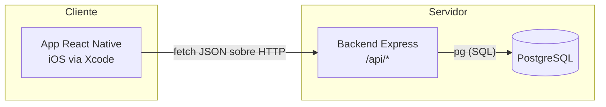

# Seis Más

App que conecta grupos de 6 personas con intereses comunes a planes sorpresa
organizados por comercios locales. Este repositorio contiene el **MVP
técnico** (Fase 2 del roadmap): registro y test de personalidad, modelo de
datos que soporta el matching, la base de la app móvil y el **matching
automático**: agrupa usuarios de a 6 por afinidad y les asigna un plan de un
comercio, eligiendo local, fecha y hora. El reemplazo de la heurística de
afinidad por un modelo entrenado (Fase de IA) sigue fuera de alcance, pero el
contrato de la API ya no cambia cuando ocurra.

## Estructura del repositorio

```
6_mas/
  db/
    DISEÑO.md      # justificación técnica del modelo de datos + diagrama ER (Mermaid)
    schema.sql     # script SQL completo (PostgreSQL)
    migrations/    # cambios aditivos posteriores al schema inicial
  backend/         # API REST Node.js + Express + PostgreSQL
  mobile/          # capa JS de la app React Native (CLI, sin Expo)
  roadmap.png      # referencia de producto (no técnico)
```

## Arquitectura general



- La app móvil habla con el backend por HTTP/JSON (`mobile/src/services/api.js`).
- El backend expone rutas REST por entidad y usa `pg` directo contra
  PostgreSQL (sin ORM, ver justificación en `backend/src/config/db.js`).
- El esquema de base de datos (`db/schema.sql`) es la fuente de verdad de las
  reglas de integridad (tamaño de grupo, rating 1-5, unicidad de email, etc.),
  no solo la capa de aplicación.

## 1. Levantar la base de datos

Requiere PostgreSQL 13+ corriendo localmente (o accesible por red).

```bash
createdb seis_mas
psql -d seis_mas -f db/schema.sql
psql -d seis_mas -f db/migrations/001_dashboard_comercios.sql
psql -d seis_mas -f db/migrations/002_matching_automatico.sql
```

Esto crea las extensiones, tablas, índices, constraints y triggers descritos
en `db/DISEÑO.md`.

## 2. Levantar el backend

```bash
cd backend
cp .env.example .env   # ajusta DATABASE_URL a tu instancia local
npm install
npm run dev             # nodemon, recarga en caliente
```

Verifica que responde:

```bash
curl http://localhost:3000/health
```

## 3. Compilar y correr la app en Xcode

La guía detallada está en `mobile/README.md`. Resumen:

1. Generar el proyecto nativo: `npx @react-native-community/cli init SeisMas`.
2. `cd ios && pod install`.
3. Abrir `SeisMas.xcworkspace` (no el `.xcodeproj`) en Xcode.
4. Configurar bundle identifier y signing team en la pestaña "Signing & Capabilities".
5. Copiar `mobile/src` dentro del proyecto generado.
6. Compilar (⌘R) contra el simulador (usa `http://localhost:3000` automáticamente)
   o un dispositivo físico (usa la IP LAN de tu Mac, configurada en
   `mobile/src/config/env.js`; requiere una excepción puntual de App Transport
   Security en desarrollo — documentada en `mobile/README.md`).

## Cómo se conectan las tres piezas

1. **Base de datos → Backend**: el backend abre un pool de conexiones (`pg`)
   usando `DATABASE_URL` del `.env`. Todas las reglas de integridad fuertes
   (unicidad, tamaño de grupo = 6, rating 1-5) viven en el propio Postgres,
   así que cualquier cliente futuro del backend (panel web de comercios,
   jobs de matching) hereda las mismas garantías sin duplicarlas en código.
2. **Backend → App móvil**: la app consume `/api/usuarios`, `/api/intereses`,
   `/api/grupos`, `/api/eventos`, `/api/comercios`, `/api/anfitriones` y
   `/api/feedback` vía `mobile/src/services/api.js`, apuntando a
   `mobile/src/config/env.js` para resolver la URL correcta según si corre en
   simulador o dispositivo físico.
3. **Flujo de usuario del MVP**: `RegistroScreen` (POST `/api/usuarios`) →
   `TestPersonalidadScreen` (POST `/api/usuarios/:id/test-personalidad`) →
   `GruposScreen` (GET `/api/grupos/:id`). La asignación a un grupo de 6 y el
   emparejamiento con eventos de comercios los resuelve `/api/matching`
   (ver abajo), que corre por fuera del flujo interactivo: el usuario queda
   "en espera" hasta que hay 6 compatibles en su ciudad.

## Matching

El matching es **automático**: se dispara solo cuando un usuario termina el
test de personalidad, y de nuevo cuando un comercio publica oferta nueva.
Nadie tiene que ejecutarlo a mano; los endpoints existen para simular,
diagnosticar y forzar.

Son dos etapas separadas a propósito, en dos módulos puros (sin Express ni
SQL) que orquesta `services/matchingRunner.js`:

| Módulo | Responde | Lo alimenta |
| --- | --- | --- |
| `services/matching.js` | **con quién** va cada persona | el usuario (test + intereses) |
| `services/programacion.js` | **dónde y cuándo** va el grupo | el comercio (planes, franjas, tier) |

Están separados porque un cambio de política comercial (los tiers) no debe
tocar el código que decide con quién se junta la gente.

| Endpoint | Qué hace |
| --- | --- |
| `GET /api/matching` | Descriptor del algoritmo, pesos y estado del pool |
| `GET /api/matching/candidatos` | Usuarios en espera de grupo |
| `GET /api/matching/oferta` | Planes y franjas que el algoritmo puede asignar hoy |
| `GET /api/matching/afinidad?a=&b=` | Desglose explicable de un par |
| `POST /api/matching/simular` | Corre todo y hace `ROLLBACK` (dry-run real) |
| `POST /api/matching/ejecutar` | Corre y persiste grupos + eventos |
| `POST /api/matching/programar` | Busca plan para grupos completos que quedaron sin él |

### Etapa 1 — con quién (`matching.js`)

1. **Pool de candidatos**: usuarios activos, con test vigente, que no
   pertenecen a ningún grupo en estado `formando`, `completo` o `activo`.
2. **Afinidad (0-1)** = 50% intereses (Jaccard, para no premiar a quien marcó
   los 6 del catálogo) + 50% coincidencia ponderada del test. Los pesos están
   en `PESOS_RESPUESTAS`: alto lo que hace viable el plan (localidad, tipo de
   plan, temperamento, edad), bajo lo decorativo (zodiaco, animal favorito).
   `genero_biologico`, `identidad`, `disposicion` y `valores` se excluyen del
   score a propósito: agrupar por identidad sería segregar.
3. **Formación**: greedy anclado en el candidato que lleva más tiempo
   esperando, agregando de a uno al que maximiza la afinidad media con los ya
   elegidos. La semilla por antigüedad es deliberada — un greedy que arranca
   por el par más afín deja a los perfiles atípicos sin grupo para siempre.
4. **Localidad como filtro duro** (desactivable con
   `agrupar_por_localidad: false`): el pool se parte por ciudad antes de
   puntuar, porque los planes son presenciales.
5. Si sobran menos de 6 **no se forma un grupo incompleto**: quedan en espera
   con su antigüedad acumulada, que es lo que los pone primeros la próxima vez.

### Etapa 2 — dónde y cuándo (`programacion.js`)

El comercio declara dos cosas en el dashboard: sus **planes**
(`comercio_planes`: una experiencia atada a un interés del catálogo) y su
**disponibilidad** (`comercio_disponibilidad`: franjas recurrentes por día de
la semana, con cupo de grupos). El algoritmo materializa la fecha concreta.

Orden de decisión, y este orden **es** la política del producto:

1. **Afinidad** — filtro duro. Un plan compite solo si al menos la mitad del
   grupo comparte su interés (`score_minimo`, 0.5 por defecto).
2. **Tier del comercio** (`pa_planes_comercio`: bronce → premium) — desempata
   *solo entre ofertas igual de afines*. Es lo que el comercio compra con su
   plan. **Nunca le gana a la afinidad**: un premium cuya oferta no le
   interesa al grupo no recibe al grupo. Si los grupos salen a planes que no
   les gustan se cae el lado del producto que sostiene todo el negocio.
3. **Fecha más cercana** — primera franja libre del comercio, respetando 48h
   de anticipación mínima y una ventana de 21 días (`horas_minimas`,
   `dias_ventana`). El plan tiene que caber entero en la franja, y la franja
   no puede estar en su tope de `grupos_max` ese día.

Los tiers son de los **restaurantes**, no de los usuarios: no segmentan con
quién se agrupa la gente.

Si ningún plan supera el umbral, el grupo queda `completo` **sin plan** en vez
de recibir uno malo, y lo recibe automáticamente en cuanto un comercio de su
ciudad publique oferta afín. Con plan asignado el grupo pasa a `activo`.

### Garantías de concurrencia

Cada corrida toma un `pg_advisory_xact_lock` y hace todo en una sola
transacción, con `FOR UPDATE` sobre los usuarios elegidos: dos usuarios
terminando el test a la vez no pueden producir dos grupos con la misma gente.
El disparo automático corre **después** de responderle al cliente y nunca
propaga su error: quien acaba de contestar 20 preguntas no debe esperar al
matching ni ver un 500 si el matching falla.

### Prueba end-to-end

Siembra 4 restaurantes (dos con la misma oferta y distinto tier, uno premium
poco afín, uno en otra ciudad), registra 6 usuarios sin llamar al matching y
valida 15 condiciones sobre lo que el sistema hizo solo:

```bash
psql -d seis_mas -f db/migrations/002_matching_automatico.sql
cd backend && npm start                        # en otra terminal
node backend/scripts/prueba_match.js           # deja los datos
node backend/scripts/prueba_match.js --limpiar # los borra al terminar
```

## Decisiones de diseño relevantes (resumen)

- **UUIDs en vez de IDs secuenciales** en todas las PK: evita filtrar volumen
  de negocio por IDs y facilita generación distribuida a futuro.
- **Soft delete (`deleted_at`)** en usuarios, grupos, comercios, anfitriones y
  eventos: preserva trazabilidad e integridad referencial del historial
  aunque una entidad se "borre" desde la app.
- **`grupo_miembros` como tabla puente**, con el límite de 6 forzado por
  trigger (no por columnas fijas `usuario_1..usuario_6`): permite grupos en
  formación y consultas naturales de pertenencia.
- **`tests_personalidad` como historial 1:N con flag `vigente`**: conserva
  todos los intentos del usuario para si el algoritmo de matching necesita
  reentrenarse o comparar versiones del test.
- **Sin JWT/OAuth en el MVP**: login simple con verificación de bcrypt
  (`POST /api/usuarios/login`). Es una decisión explícita de alcance — añadir
  JWT o sesiones después es un cambio de la capa de autenticación del
  backend, no del esquema de datos.
- **Matching como servicio puro + ruta delgada**: `services/matching.js` no
  conoce Express ni SQL, así que se puede probar sin levantar nada y lo puede
  reusar un job nocturno o el panel de comercios sin pasar por HTTP. Cuando
  la heurística se reemplace por un modelo, el cambio queda contenido ahí.
- **Los grupos incompletos no se materializan**: si sobran 4 candidatos, no
  se crea un grupo de 4. Un grupo a medio llenar deja a sus miembros
  "ocupados" (fuera del pool) sin plan, que es peor que esperar.
- **El tier comercial nunca le gana a la afinidad**: solo desempata entre
  ofertas igual de afines. Vender prioridad absoluta sería vender la
  experiencia del usuario, que es el activo que hace vendible la prioridad.
- **La oferta del comercio se lee por vistas, no por tablas**: la API social
  (rol `seis_app`) sigue sin permiso sobre `comercios`, `comercio_planes` ni
  `comercio_disponibilidad`; ve `v_oferta_comercio`,
  `v_disponibilidad_comercio` y `v_evento_disponible`. El tier va en esas
  vistas y no en `v_comercio_publico` porque qué plan paga un restaurante no
  es asunto del usuario.
- **La disponibilidad es recurrente y el evento es la reserva**: el comercio
  declara franjas por día de la semana y el cupo consumido se cuenta sobre
  `eventos`. Una tabla de reservas aparte sería un segundo lugar donde la
  verdad se puede desincronizar.
