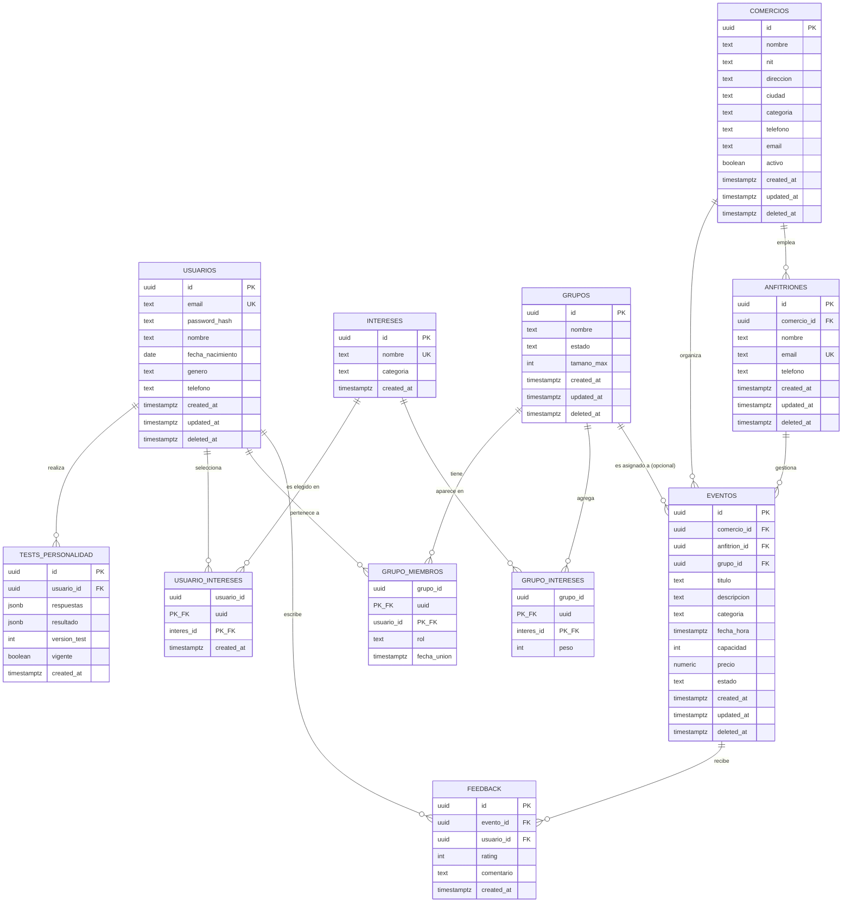

# Diseño de base de datos — Seis Más

Este documento justifica el modelo relacional que soporta el MVP técnico (Fase 2 del
roadmap: registro, test de personalidad, grupos de 6, eventos con comercios/anfitriones
y feedback). El objetivo del diseño no es solo cubrir el MVP, sino evitar que las fases
futuras (experiencia de usuario avanzada, alianzas comerciales, IA de matching) obliguen
a reescribir el esquema — para eso se dejan puntos de extensión explícitos (ver sección
"Ganchos para fases futuras").

## Principios transversales

- **UUIDs como PK en vez de IDs secuenciales.** Los IDs secuenciales (`SERIAL`/`BIGSERIAL`)
  filtran información de negocio (cuántos usuarios/eventos existen, tasa de crecimiento) y
  son adivinables, lo cual es un riesgo en una API pública donde los IDs viajan en URLs
  (`/api/grupos/:id`). UUIDv4 (`gen_random_uuid()`, extensión `pgcrypto`) evita ambos
  problemas y además simplifica una futura sincronización multi-región o generación de IDs
  desde el cliente móvil sin colisiones.
- **Contraseñas nunca en texto plano.** `usuarios.password_hash` almacena únicamente el hash
  bcrypt (columna `text`, nunca `varchar` corto que trunque el hash). El backend nunca debe
  hacer `SELECT *` sobre usuarios en respuestas públicas; se documenta en el código.
- **Soft deletes vía `deleted_at timestamptz`.** Usuarios, grupos, comercios, anfitriones y
  eventos usan borrado lógico en vez de `DELETE` físico. Razón: (a) trazabilidad para
  soporte/disputas comerciales, (b) integridad referencial — un usuario que borra su cuenta
  no debe romper el historial de eventos/feedback de otros miembros del grupo, (c) es
  requisito típico de cumplimiento (poder auditar qué pasó, aunque el usuario ya no sea
  "activo"). Las consultas normales filtran `WHERE deleted_at IS NULL`.
- **Auditoría temporal.** Toda tabla mutable tiene `created_at timestamptz default now()` y,
  cuando aplica, `updated_at timestamptz` mantenido por un trigger genérico
  (`set_updated_at()`), en vez de confiar en que cada UPDATE del backend lo actualice a mano.
- **Integridad referencial explícita con `ON DELETE` intencional** en cada FK, en vez del
  default de Postgres (`NO ACTION`), para que el comportamiento ante borrados sea una
  decisión de diseño y no un accidente (detalle tabla por tabla más abajo).
- **Constraints `CHECK` en el motor, no solo en la app.** El tamaño de grupo (6) y el rating
  de feedback (1-5) se validan en la base de datos porque la app móvil no es la única
  escritora posible a futuro (backoffice de comercios, jobs de matching, etc.).

## Tablas y justificación

### `usuarios`
Identidad central. Incluye `password_hash` (bcrypt), datos de perfil mínimos
(`nombre`, `fecha_nacimiento`, `genero`, `telefono`) necesarios para el test de personalidad
y el matching, y `email` con índice único (login). No se modela autenticación avanzada
(JWT/refresh tokens/OAuth) a propósito — está fuera del alcance del MVP; el campo
`password_hash` es suficiente para un login básico con sesión simple, y se documenta en el
backend cómo añadir JWT después sin tocar el esquema.

### `tests_personalidad`
Se modela **1:N histórico** (un usuario puede tener varios registros de test en el tiempo)
con una columna `vigente boolean` que marca cuál es el resultado activo, en vez de 1:1
estricto. Justificación: el roadmap prevé evolución del algoritmo de matching (Fase de IA);
si el test cambia de versión o el usuario lo repite, se necesita el historial completo para
reentrenar/comparar sin perder datos. Un índice único parcial
(`UNIQUE (usuario_id) WHERE vigente`) garantiza que solo haya un test vigente por usuario a
nivel de motor, no solo de aplicación. `respuestas` y `resultado` se guardan en `jsonb`
porque el cuestionario y el modelo de resultado van a cambiar de forma antes de que el
esquema relacional lo haga (evita migraciones constantes por cada pregunta nueva).

### `intereses` y `usuario_intereses`
`intereses` es catálogo controlado (nombre único + categoría) para que el matching pueda
agrupar por categoría sin depender de texto libre. `usuario_intereses` es la tabla puente
N:M con PK compuesta `(usuario_id, interes_id)`, evitando duplicados sin necesitar un UUID
propio para una relación que no tiene atributos propios más allá de la fecha de registro.

### `grupos` y `grupo_miembros`
`grupos` no fija los 6 miembros como columnas (`usuario_1..usuario_6`) porque eso impediría
manejar grupos incompletos durante el proceso de formación (estado `formando`) y
complicaría cualquier consulta ("¿en qué grupos está el usuario X?"). En su lugar,
`grupo_miembros` es la tabla puente N:M con `UNIQUE (grupo_id, usuario_id)` y el tamaño
máximo de 6 se garantiza con un **trigger** (`enforce_grupo_max_6`) en vez de un `CHECK`
simple, porque un CHECK no puede contar filas de otra tabla. `grupos.estado` (enum) permite
representar el ciclo de vida (`formando → completo → activo → finalizado/cancelado`) que la
Fase de IA de matching necesitará para saber sobre qué grupos operar.

### `grupo_intereses`
Tabla de soporte: agrega los intereses dominantes del grupo (derivados de sus miembros) para
que el backend de matching de eventos no tenga que recalcular agregaciones sobre
`usuario_intereses` en cada consulta. Es redundancia intencional y documentada, no
sobre-diseño: es el gancho directo para el matching de eventos↔grupos de la fase de IA.

### `comercios`
Representa el negocio local que organiza eventos. Incluye `activo boolean` además de
`deleted_at` porque un comercio puede pausarse temporalmente (temporada baja) sin ser
borrado — dos estados distintos con significado de negocio distinto.

### `anfitriones`
Un anfitrión gestiona eventos y pertenece a un comercio (`comercio_id` FK). Se modela como
entidad separada de `usuarios` (no hereda de ella) porque en el MVP un anfitrión es personal
del comercio, no necesariamente alguien que se registra como usuario final de la app de
grupos; esto también evita mezclar roles de autenticación distintos en una sola tabla desde
el día uno. Si en el futuro un anfitrión necesita loguearse en un panel propio, se añade su
propio `password_hash` aquí sin afectar `usuarios`.

### `eventos`
Pertenece a un `comercio_id` (obligatorio) y a un `anfitrion_id` (obligatorio, quien lo
gestiona). `grupo_id` es **nullable**: un evento puede publicarse antes de tener grupo
asignado (propuesta de plan) y luego enlazarse a un grupo cuando el matching decide
asignarlo — exactamente el punto de extensión que la fase de IA de matching necesita.
`estado` (enum) trazabiliza el ciclo de vida del evento.

### `feedback`
Se asocia a `evento_id` y `usuario_id` (quién opinó sobre qué evento), con
`UNIQUE (evento_id, usuario_id)` para evitar múltiples calificaciones del mismo usuario al
mismo evento, y `CHECK (rating BETWEEN 1 AND 5)`. No tiene `deleted_at`: el feedback es un
registro de auditoría/negocio (reputación de comercios) que no debería poder desaparecer
lógicamente vía la misma vía que el resto de entidades; si se necesita moderar, se añadiría
un campo `oculto boolean` explícito en vez de reutilizar soft-delete.

## Ganchos para fases futuras (sin romper el esquema actual)

- **Matching por IA**: `tests_personalidad.respuestas/resultado` en `jsonb` + `grupo_intereses`
  + `eventos.grupo_id` nullable ya dan la superficie de datos necesaria; el algoritmo se monta
  encima como un servicio que lee estas tablas, no requiere nuevas columnas estructurales.
- **Alianzas comerciales**: `comercios.activo` y un futuro `plan_comercial` (columna a añadir)
  no rompen nada existente.
- **Escalabilidad**: UUIDs permiten generación distribuida de IDs (sharding futuro sin
  colisión), y los soft-deletes permiten particionar/archivar datos "borrados" sin perder
  integridad referencial.

## Diagrama entidad-relación

