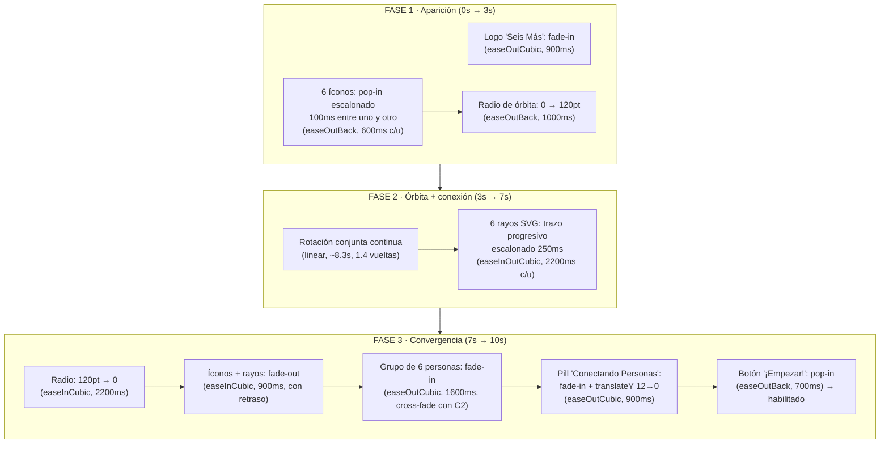

# Animación de bienvenida (splash) — Seis Más

Documentación de `WelcomeAnimationScreen` y sus componentes auxiliares en
`mobile/src/components/animation/`. Replica animada del póster de referencia
en `images/home_1.png`: 6 íconos de intereses orbitando alrededor del logo con
rayos dorados de conexión, sobre un fondo degradado azul→naranja con
partículas, que converge en un grupo de personas + "Conectando Personas" y un
botón final.

## Requisito previo de configuración: plugin de Babel de Reanimated

`react-native-reanimated` (usado en todos los componentes de esta carpeta)
**requiere** su plugin de Babel para funcionar — sin él, `useAnimatedStyle`,
`useSharedValue`, etc. compilan pero las animaciones no corren en el hilo de
UI (o directamente fallan en runtime). Cuando se genere el proyecto nativo
con el CLI (ver `mobile/README.md`, paso 1) hay que agregar en
`babel.config.js`:

```js
module.exports = {
  presets: ['module:metro-react-native-babel-preset'],
  plugins: ['react-native-reanimated/plugin'], // debe ser el ÚLTIMO plugin de la lista
};
```

## Diagrama de fases



## Lógica de movimiento: trayectorias circulares

Cada ícono tiene un **ángulo base fijo** (posición dentro del hexágono,
constante durante toda la animación) más una **rotación compartida** que gira
el conjunto de los 6 íconos juntos, como si fueran las agujas de un reloj
sincronizadas entre sí.

Dado el ángulo total `θ = ángulo_base + rotación_orbita` (en radianes,
medido en sentido horario desde las 12) y el radio actual `r`, la posición
cartesiana relativa al centro de la pantalla es:

```
x = r · sin(θ)
y = -r · cos(θ)
```

El signo negativo en `y` es porque en React Native el eje Y crece hacia
abajo, y a las 12 en punto (θ = 0) el ícono debe quedar **arriba** del
centro, es decir con `y` negativa.

Los 6 ángulos base están repartidos cada 60° (2π/6 rad), arrancando en −30°
en vez de 0° para que ningún ícono quede exactamente arriba o abajo del logo
— igual que en la imagen de referencia, donde tampoco hay un ícono a las 12
o a las 6 en punto:

| Interés      | Grados | Posición aproximada  |
|--------------|-------:|-----------------------|
| Bienestar ❤️  |   −30° | arriba-izquierda       |
| Fitness 💪    |    30° | arriba-derecha         |
| Tecnología 🥽 |    90° | derecha                |
| Lectura 📖    |   150° | abajo-derecha          |
| Música 🎵     |   210° | abajo-izquierda        |
| Gastronomía 🍴|   270° | izquierda              |

Este cálculo corre dentro de `useAnimatedStyle` / `useAnimatedProps`
(worklets), es decir en el hilo de UI, en cada frame — necesario para que la
órbita se sienta fluida a 60fps sin cruzar el puente hacia JS en cada tick.

### Por qué "radio" en vez de animar x/y directamente

`radio` es un único shared value compartido por los 6 íconos y las 6 líneas.
Animarlo (crece en fase 1, se mantiene en fase 2, colapsa a 0 en fase 3) mueve
a todos los íconos hacia/desde el centro en simultáneo sin necesitar 6
animaciones idénticas — y es exactamente lo que representa "converger al
centro": todos con el mismo radio final (0).

## Por qué estos tiempos y curvas de easing

**Reparto de los 10s (3s / 4s / 3s):** la fase de órbita (fase 2) es la más
larga porque es la que necesita tiempo tanto para mostrar el giro como para
dibujar los 6 rayos escalonados sin que se sientan apurados (250ms × 6 ≈
1.5s de arranques escalonados + 2.2s de trazo cada uno, con superposición).
Las fases 1 y 3 son más cortas porque son transiciones (entrada/salida), no
el estado "estable" que se quiere que el usuario perciba.

**`Easing.out(Easing.back(...))` en apariciones (logo, íconos, radio inicial,
botón):** produce un ligero "rebote" al llegar a destino — se siente como si
el elemento tuviera energía/personalidad al aparecer, en vez de simplemente
desvanecerse en su lugar. Se usa consistentemente en todo lo que "entra" a
la escena.

**`Easing.linear` en la rotación de la órbita:** una órbita real (planetas,
un carrusel) gira a velocidad angular constante — usar cualquier curva de
aceleración/desaceleración en un movimiento circular *sostenido* se vería
mecánicamente "raro", porque el ojo espera que un giro continuo no frene ni
acelere sin motivo visual que lo justifique.

**`Easing.inOut(Easing.cubic)` en el trazo de las líneas:** es la curva
"orgánica" por defecto para algo que debe sentirse dibujado a mano (acelera
saliendo del centro, desacelera acercándose al ícono) en vez de una línea que
avanza a velocidad constante como una barra de progreso.

**`Easing.in(Easing.cubic)` en la convergencia (radio → 0) y en los
fade-outs:** una convergencia se siente más natural si *acelera* hacia el
final — como si el centro "atrajera" los íconos con fuerza creciente — al
contrario del out-easing usado en las apariciones. Es la razón por la que no
se reutiliza el mismo easing para aparecer y para converger, aunque
matemáticamente ambos sean curvas cúbicas.

**Solapes entre fase 3 y sus sub-elementos:** el grupo de personas empieza a
aparecer (800ms de retraso) *antes* de que íconos/líneas terminen de
desvanecerse (1400ms de retraso) — es un cross-fade deliberado, no una
secuencia estrictamente encadenada. Un corte seco "primero desaparece todo,
después aparece el grupo" se percibe como una pausa muerta; el solape la
elimina.

## Componentes

| Archivo | Responsabilidad |
|---|---|
| `screens/WelcomeAnimationScreen.js` | Orquestador: define shared values, timeline de las 3 fases, fondo degradado, logo, pill y botón final. |
| `components/animation/OrbitingIcon.js` | Un ícono individual: calcula su posición orbital y aplica opacidad/escala de aparición y desvanecido. |
| `components/animation/ConnectionLines.js` | SVG con los 6 rayos centro→ícono, con `strokeDashoffset` animado para el efecto de trazo progresivo. |
| `components/animation/ParticleBackground.js` | Partículas de fondo simuladas (opacidad oscilante en posiciones aleatorias fijas, sin física real). |
| `components/animation/LottieParticles.js` | Alternativa documentada (no activa) a `ParticleBackground` usando Lottie — ver siguiente sección. |

## Alternativa con Lottie: cuándo y cómo

`ParticleBackground.js` simula partículas con `Animated.View`s y opacidad
oscilante — funciona bien para este MVP, pero un diseñador no puede iterarlo
visualmente sin tocar código React. `LottieParticles.js` documenta cómo
reemplazarlo por una animación Lottie real si en el futuro se justifica esa
inversión (por ejemplo, si el equipo de diseño empieza a producir animaciones
en After Effects para reusar en múltiples plataformas).

No se generó el JSON de Lottie a mano en este trabajo porque:

1. Un archivo Bodymovin fiel a un diseño visual (curvas bezier de cientos de
   keyframes, capas con máscaras, etc.) no es razonable de escribir a mano —
   se produce exportando desde una herramienta de animación real.
2. La tarea pide *documentar* la alternativa e instalar la dependencia, no
   implementar el JSON completo.

### Cómo exportar de After Effects a Lottie (Bodymovin)

1. Instalar el plugin **Bodymovin** en After Effects (Window → Extensions →
   Bodymovin, o descargarlo desde su repositorio oficial e instalarlo como
   extensión `.zxp`/`.uxp`).
2. Diseñar la animación usando solo capas y propiedades soportadas por
   Lottie: formas vectoriales, máscaras simples, texto, opacidad/posición/
   escala/rotación. Evitar efectos de After Effects que Lottie no soporta
   (blurs complejos, efectos de partículas nativos de AE, expresiones no
   estándar) — Bodymovin los ignora silenciosamente o rompe la exportación.
3. Abrir el panel de Bodymovin, seleccionar la composición a exportar,
   indicar la carpeta de destino y exportar. Genera un `.json` (y
   opcionalmente assets de imagen si la animación usa bitmaps).
4. Copiar el `.json` a `mobile/src/assets/animations/` (crear la carpeta) y
   cargarlo en `LottieParticles.js` como se documenta en los comentarios de
   ese archivo.
5. Verificar el render antes de integrarlo: `lottie-react-native` no soporta
   el 100% de las features de Lottie-web, así que conviene previsualizar el
   JSON con [LottieFiles](https://lottiefiles.com/preview) o similar antes de
   asumir que se verá igual en la app.

La misma exportación de Bodymovin es reutilizable en Lottie-web (para una
futura landing page) y en Lottie-Android/iOS nativo si el proyecto migrara
esas piezas fuera de React Native — es la principal ventaja de este camino
sobre animaciones hechas a mano con Reanimated, que son específicas de React
Native.

## Dependencias añadidas a `package.json`

```json
"react-native-reanimated": "^3.15.0",
"react-native-svg": "^15.4.0",
"react-native-linear-gradient": "^2.8.3",
"lottie-react-native": "^6.7.2"
```

Se usó `react-native-linear-gradient` (no `expo-linear-gradient`) porque el
proyecto es React Native CLI puro, sin runtime de Expo (ver
`mobile/README.md`). No se agregó `react-native-vector-icons`: no estaba
presente antes en el proyecto y los 6 íconos de intereses se resuelven con
emoji dentro de círculos de color, suficiente como placeholder sin sumar una
dependencia nativa nueva solo para este splash.
